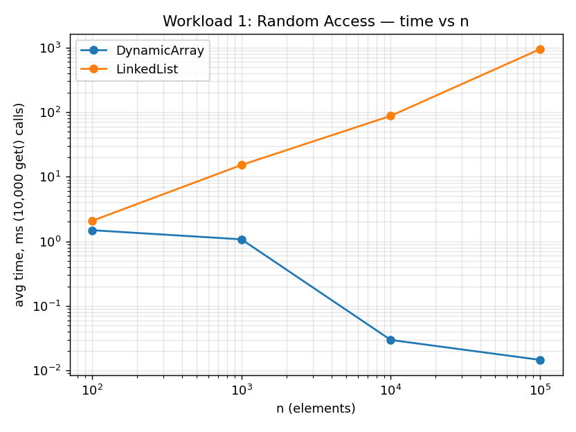
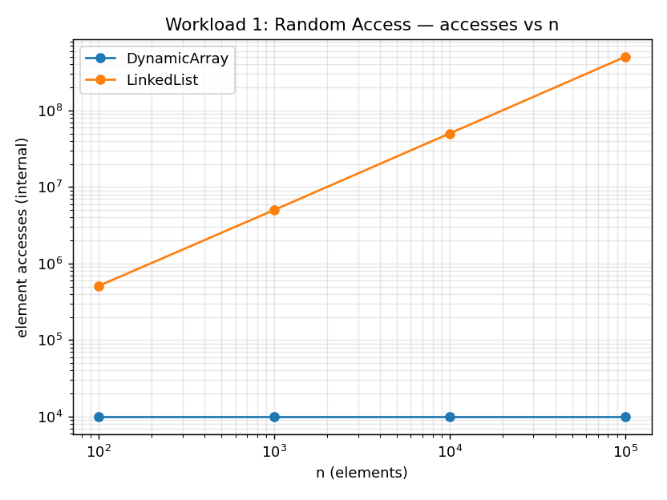
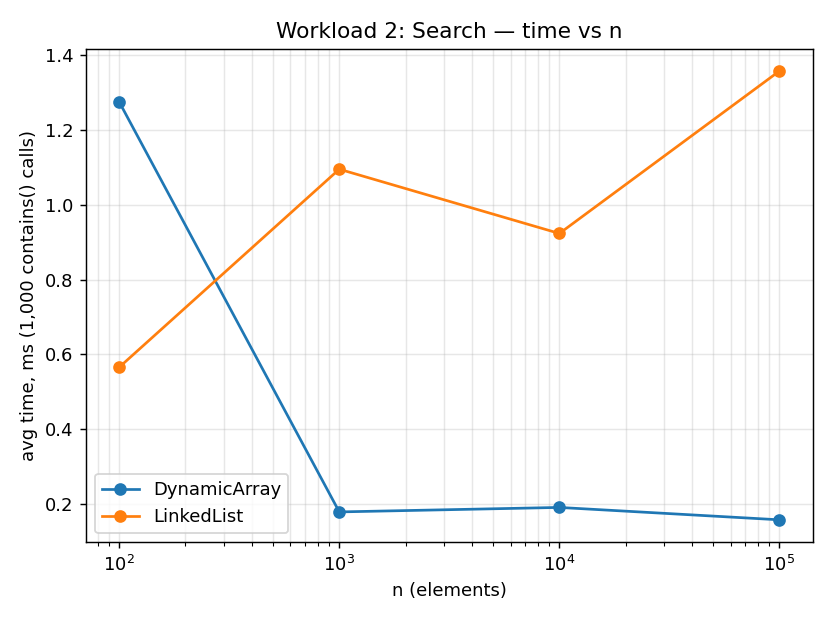
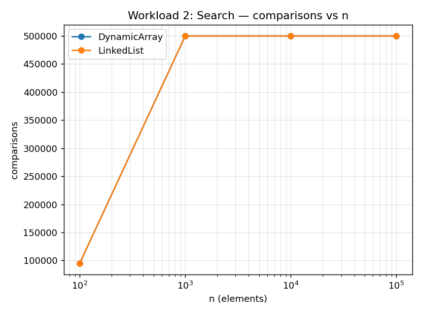
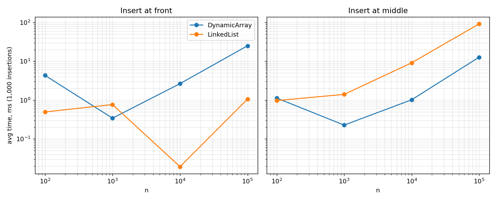
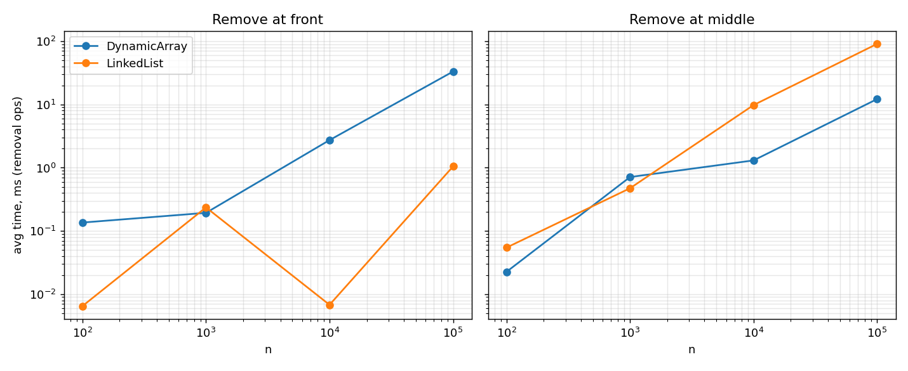
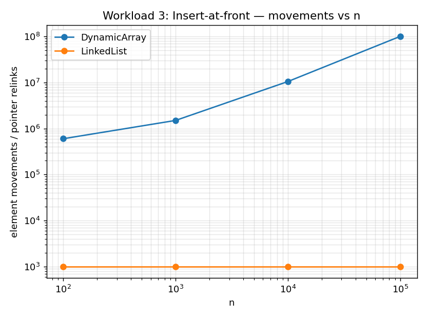
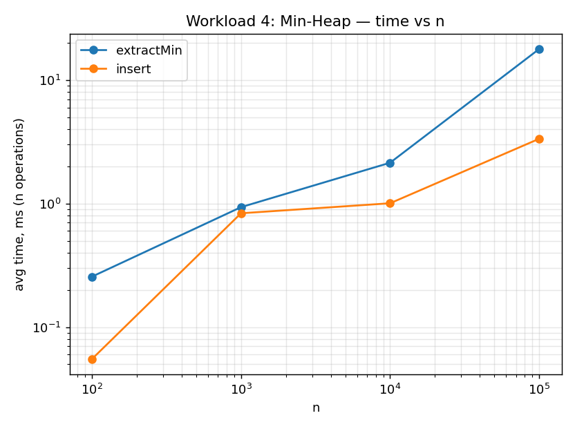
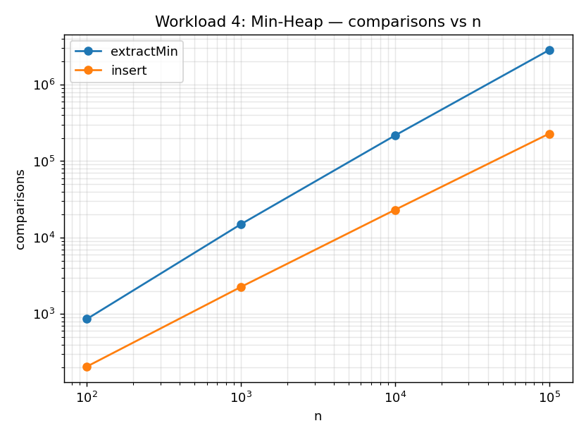

# Assignment 2 — Algorithmic Analysis, Correctness and Performance Trade-offs

## 1. Overview

This project implements and analyzes three data structures in Java:

- **DynamicArray** — a resizable array (doubling growth, no shrink) supporting
  `add(x)`, `add(index, x)`, `remove(index)`, `get(index)`, `contains(x)`.
- **MyLinkedList** — a singly linked list with a head pointer only (no tail
  pointer), supporting the same five operations. Named `MyLinkedList` rather
  than `LinkedList` so it does not collide with `java.util.LinkedList`, which
  is used for cross-validation in `Tests.java`.
- **MinHeap** — an array-backed binary min-heap supporting `insert(x)`,
  `peekMin()`, `extractMin()`.

The goal is not just to implement these structures but to prove two of their
operations correct via loop invariants, derive their asymptotic complexity,
and confirm (or explain deviations from) that theory with real, measured
benchmarks across four workloads and four input sizes
(n = 100 / 1,000 / 10,000 / 100,000).

## 2. Complexity Analysis

### Dynamic Array

| Operation      | Best            | Average  | Worst      | Aux. space                         | Why                                                                                                                                                                   |
|----------------|-----------------|----------|------------|------------------------------------|-----------------------------------------------------------------------------------------------------------------------------------------------------------------------|
| `get(i)`       | Θ(1)            | Θ(1)     | Θ(1)       | O(1)                               | direct index into backing array                                                                                                                                       |
| `add(x)`       | Ω(1)            | Θ(1)*    | O(n)       | O(1) amortized, O(n) during resize | doubling means resize happens on `log₂ n` of the `n` calls; amortized analysis (aggregate method) gives O(1) average per call even though any single call can be O(n) |
| `add(i, x)`    | Ω(1) (i=size)   | Θ(n)     | O(n) (i=0) | O(1)                               | must shift every element after `i` right by one                                                                                                                       |
| `remove(i)`    | Ω(1) (i=size-1) | Θ(n)     | O(n) (i=0) | O(1)                               | must shift every element after `i` left by one                                                                                                                        |
| `contains(x)`  | Ω(1)            | Θ(n)     | O(n)       | O(1)                               | linear scan, best case hits on first element                                                                                                                          |

\*Amortized; a single worst-case call touching a resize is O(n).

### Linked List (singly linked, head pointer only, this implementation)

| Operation         | Best       | Average  | Worst           | Aux. space | Why                                                 |
|-------------------|------------|----------|-----------------|------------|-----------------------------------------------------|
| `get(i)`          | Ω(1) (i=0) | Θ(n)     | O(n) (i=size-1) | O(1)       | must walk `i` links from head — no random access    |
| `add(x)` (append) | Θ(n)       | Θ(n)     | Θ(n)            | O(1)       | **always** walks to the tail (no tail pointer kept) |
| `add(i, x)`       | Ω(1) (i=0) | Θ(n)     | O(n)            | O(1)       | O(1) at the head, otherwise walk to `i-1`           |
| `remove(i)`       | Ω(1) (i=0) | Θ(n)     | O(n)            | O(1)       | same reasoning as `add(i,x)`                        |
| `contains(x)`     | Ω(1)       | Θ(n)     | O(n)            | O(1)       | linear traversal                                    |

**Operations that look similar but cost differently:** `add(x)` (append to
end) is amortized **O(1)** on the Dynamic Array but **O(n)** on this Linked
List, purely because the array has random access to its last slot while the
list has no tail pointer and must walk the whole chain. This is the clearest
example in the assignment of two "same name, same purpose" operations with
very different real costs — confirmed by the Workload 1 benchmark, where the
list's access time grows linearly with `n` while the array's stays flat.

### Min-Heap (array-backed)

| Operation      | Best                             | Average  | Worst    | Aux. space     | Why                                                                                          |
|----------------|----------------------------------|----------|----------|----------------|----------------------------------------------------------------------------------------------|
| `peekMin()`    | Θ(1)                             | Θ(1)     | Θ(1)     | O(1)           | root is always at index 0                                                                    |
| `insert(x)`    | Ω(1)                             | Θ(log n) | O(log n) | O(1) amortized | sift-up traverses at most the tree height; best case: new element already ≥ parent, no swaps |
| `extractMin()` | Ω(1) (heap becomes empty/size 1) | Θ(log n) | O(log n) | O(1)           | replace root with last element, then sift-down at most the tree height                       |

*(Full justification prose for each row is inline in the tables above.)*

## 3. Correctness — Loop Invariant Proofs

### Loop Invariant Proof 1 — `DynamicArray.remove(index)`

```java
for (int i = index; i < size - 1; i++) {
    data[i] = data[i + 1];
}
size--;
```

**Loop invariant:** At the start of each iteration of the `for` loop, the
subarray `data[0..i-1]` holds exactly the final, post-removal sequence of
elements for positions `0..i-1`: it is untouched for `0..index-1`, and for
`index..i-1` it already holds what was originally at `index+1..i`
(i.e., every element to the left of `i` has been shifted one position left
where required).

- **Initialization:** Before the first iteration, `i = index`. The claim
  "`data[0..i-1]` = `data[0..index-1]`" is trivially true (empty range when
  `i == index`), since nothing left of `index` needs to change. The invariant
  holds vacuously.

- **Maintenance:** Assume the invariant holds at the start of an iteration
  with a given `i` (`i < size - 1`). The loop body executes
  `data[i] = data[i + 1]`, copying the original value that was at position
  `i+1` into position `i`. By the invariant, positions `0..i-1` already hold
  their final values, and this assignment now makes position `i` hold its
  final value too (the element that should occupy slot `i` after the
  element at `index` is removed is precisely the original `data[i+1]`).
  So after the assignment, `data[0..i]` holds the final values, which is
  exactly the invariant restated for `i+1` at the start of the next
  iteration.

- **Termination:** The loop terminates when `i == size - 1` (the condition
  `i < size - 1` fails). By the invariant, at that point `data[0..size-2]`
  holds the final values for all positions `0..size-2`. The last iteration
  copied the original `data[size-1]` into `data[size-2]`, so the element
  originally at `index` has been fully overwritten and every subsequent
  element has shifted one slot left.

- **Correctness from the invariant at termination:** Combined with the
  subsequent `size--`, the structure now represents exactly the original
  sequence with the element at `index` removed and no gaps introduced —
  which is the postcondition `remove(index)` must satisfy. Since the
  invariant guarantees this for every reachable exit point of the loop
  (there is only one, the natural loop condition), the operation is proven
  correct.

---

### Loop Invariant Proof 2 — `MinHeap.siftDown(index)` (used by `extractMin`)

```java
private void siftDown(int index) {
    while (true) {
        int left = 2 * index + 1, right = 2 * index + 2;
        int smallest = index;
        if (left < size && data[left] < data[smallest]) smallest = left;
        if (right < size && data[right] < data[smallest]) smallest = right;
        if (smallest == index) break;
        swap(index, smallest);
        index = smallest;
    }
}
```

**Loop invariant:** At the start of each iteration, the binary tree rooted
at `index` is the *only* part of the heap that may violate the min-heap
property (every node's value ≤ both children's values); every other node in
the array-backed tree already satisfies the heap property with respect to
its subtree.

- **Initialization:** `siftDown` is called right after `data[0]` was
  overwritten by the former last element (inside `extractMin`). At that
  moment the two subtrees of the root are untouched, valid heaps (they were
  valid before the extraction, since removing a leaf/rearranging only the
  root doesn't affect them), so the *only* place the property can be broken
  is at the root itself — i.e. at `index = 0`. The invariant holds before
  the first iteration.

- **Maintenance:** Assume the invariant holds for the current `index`: only
  the subtree rooted at `index` may be invalid, and only possibly at its
  very root. The loop computes `smallest`, the position among `{index, left,
  right}` holding the minimum value (comparing at most twice — one
  comparison per existing child), so `data[smallest]` is ≤ both children of
  `index`.
    - If `smallest == index`, the node already satisfies the heap property
      relative to its children, and since both child subtrees were already
      valid heaps by assumption, the whole subtree is now valid — the loop
      breaks.
    - Otherwise, `swap(index, smallest)` moves the smaller child's value into
      `index`. This fixes the violation at `index` (its new value is now ≤
      both children). However, the value that moved down to `smallest` (the
      element bumped out of the root position) may now violate the heap
      property between `smallest` and *its* children — so the invariant
      ("only one subtree may be invalid, and only at its root") is restored
      with the new `index = smallest`.

- **Termination:** Each iteration either breaks immediately or moves
  `index` strictly one level deeper (`index` becomes `left` or `right`,
  i.e., `2*index+1` or `2*index+2`, both strictly greater than `index`).
  Since the tree has a bounded height (`⌊log₂ size⌋ + 1`), `index` cannot
  keep increasing forever; the loop must reach a leaf or a `smallest ==
  index` case and terminate after at most `O(log n)` iterations.

- **Correctness from the invariant at termination:** The loop can only exit
  when `smallest == index`, i.e., precisely when the invariant's "possible
  violation point" no longer exists — the node at `index` is ≤ both its
  children, and both of its child subtrees are (by the invariant, carried
  down from the initial call) already valid heaps. Therefore the whole tree
  rooted at the original call site satisfies the min-heap property, which is
  exactly what `extractMin` requires after removing the old root.

---

## 4. Experimental Setup

- **n** (initial elements): 100, 1,000, 10,000, 100,000 — used for every workload.
- **m** (operations per workload): 10,000 `get()` calls (Workload 1), 1,000
  `contains()` calls (Workload 2), 1,000 insertions/removals per position
  (Workload 3), n inserts + n extracts (Workload 4).
- **Repetitions:** every timed measurement is run 5 times; the table below
  reports the **average** wall-clock time per run.
- **Timing:** `System.nanoTime()`, converted to milliseconds; only the
  operation loop itself is timed — input generation and structure
  construction happen outside the timed section.
- **Random seed:** `new Random(42)` (and `42+r` for the r-th repeat where a
  fresh randomized value stream is needed across repeats, e.g. Workload 3/4
  insert values) — reproducible across runs.
- **Two implementation decisions**, documented here because they affect how
  to read Workload 3's table:
    1. **Removal count is capped at `min(1000, n)`.** You cannot remove 1,000
       elements from a structure that only has `n = 100` elements to begin
       with; the `ops_performed` column reports the actual count used.
    2. **"Middle position" uses the *current* `size / 2`** on every iteration,
       not a fixed initial `n / 2`. A fixed index becomes invalid once enough
       elements have been removed around it (or stops being "the middle" once
       enough have been inserted), so recomputing it keeps every iteration
       meaningful.

## 5. Results

### Workload 1 — Random Access

|      n | structure    | avg_time_ms |   access_count | theoretical   |
|-------:|:-------------|------------:|---------------:|:--------------|
|    100 | DynamicArray |      1.4853 |          10000 | O(1)          |
|    100 | LinkedList   |      2.0744 |         511508 | O(n)          |
|   1000 | DynamicArray |       1.073 |          10000 | O(1)          |
|   1000 | LinkedList   |      15.181 |        5015208 | O(n)          |
|  10000 | DynamicArray |      0.0297 |          10000 | O(1)          |
|  10000 | LinkedList   |      87.562 |       50139208 | O(n)          |
| 100000 | DynamicArray |      0.0146 |          10000 | O(1)          |
| 100000 | LinkedList   |     943.819 |      502499208 | O(n)          |




### Workload 2 — Search

|      n | structure    | avg_time_ms |   comparison_count | theoretical   |
|-------:|:-------------|------------:|-------------------:|:--------------|
|    100 | DynamicArray |       1.275 |              95046 | O(n)          |
|    100 | LinkedList   |      0.5657 |              95046 | O(n)          |
|   1000 | DynamicArray |      0.1792 |             500092 | O(n)          |
|   1000 | LinkedList   |       1.095 |             500092 | O(n)          |
|  10000 | DynamicArray |      0.1912 |             500092 | O(n)          |
|  10000 | LinkedList   |      0.9233 |             500092 | O(n)          |
| 100000 | DynamicArray |      0.1581 |             500092 | O(n)          |
| 100000 | LinkedList   |      1.3575 |             500092 | O(n)          |




### Workload 3 — Insertion & Removal

|      n | structure    | position   | operation   | avg_time_ms |   movement_count |   ops_performed | theoretical   |
|-------:|:-------------|:-----------|:------------|------------:|-----------------:|----------------:|:--------------|
|    100 | DynamicArray | front      | insert      |      4.3151 |           601000 |            1000 | O(n)          |
|    100 | LinkedList   | front      | insert      |      0.4949 |             1000 |            1000 | O(1)          |
|    100 | DynamicArray | front      | remove      |      0.1359 |             4950 |             100 | O(n)          |
|    100 | LinkedList   | front      | remove      |      0.0065 |              100 |             100 | O(1)          |
|    100 | DynamicArray | middle     | insert      |      1.1262 |           301500 |            1000 | O(n)          |
|    100 | LinkedList   | middle     | insert      |      0.9709 |             1000 |            1000 | O(n)          |
|    100 | DynamicArray | middle     | remove      |      0.0226 |             2450 |             100 | O(n)          |
|    100 | LinkedList   | middle     | remove      |      0.0546 |              100 |             100 | O(n)          |
|   1000 | DynamicArray | front      | insert      |      0.3418 |          1500500 |            1000 | O(n)          |
|   1000 | LinkedList   | front      | insert      |      0.7663 |             1000 |            1000 | O(1)          |
|   1000 | DynamicArray | front      | remove      |      0.1935 |           499500 |            1000 | O(n)          |
|   1000 | LinkedList   | front      | remove      |      0.2357 |             1000 |            1000 | O(1)          |
|   1000 | DynamicArray | middle     | insert      |       0.227 |           751000 |            1000 | O(n)          |
|   1000 | LinkedList   | middle     | insert      |      1.4025 |             1000 |            1000 | O(n)          |
|   1000 | DynamicArray | middle     | remove      |      0.7127 |           249500 |            1000 | O(n)          |
|   1000 | LinkedList   | middle     | remove      |      0.4739 |             1000 |            1000 | O(n)          |
|  10000 | DynamicArray | front      | insert      |      2.6527 |         10509500 |            1000 | O(n)          |
|  10000 | LinkedList   | front      | insert      |      0.0193 |             1000 |            1000 | O(1)          |
|  10000 | DynamicArray | front      | remove      |      2.7345 |          9499500 |            1000 | O(n)          |
|  10000 | LinkedList   | front      | remove      |      0.0068 |             1000 |            1000 | O(1)          |
|  10000 | DynamicArray | middle     | insert      |      1.0179 |          5260000 |            1000 | O(n)          |
|  10000 | LinkedList   | middle     | insert      |      9.1246 |             1000 |            1000 | O(n)          |
|  10000 | DynamicArray | middle     | remove      |      1.3056 |          4749500 |            1000 | O(n)          |
|  10000 | LinkedList   | middle     | remove      |      9.7937 |             1000 |            1000 | O(n)          |
| 100000 | DynamicArray | front      | insert      |     25.0335 |        100599500 |            1000 | O(n)          |
| 100000 | LinkedList   | front      | insert      |      1.0595 |             1000 |            1000 | O(1)          |
| 100000 | DynamicArray | front      | remove      |     33.1868 |         99499500 |            1000 | O(n)          |
| 100000 | LinkedList   | front      | remove      |      1.0471 |             1000 |            1000 | O(1)          |
| 100000 | DynamicArray | middle     | insert      |     12.7397 |         50350000 |            1000 | O(n)          |
| 100000 | LinkedList   | middle     | insert      |     91.7028 |             1000 |            1000 | O(n)          |
| 100000 | DynamicArray | middle     | remove      |     12.1736 |         49749500 |            1000 | O(n)          |
| 100000 | LinkedList   | middle     | remove      |     90.8533 |             1000 |            1000 | O(n)          |





### Workload 4 — Priority Processing (Min-Heap)

|      n | phase      |   avg_time_ms |   comparison_count | theoretical   |
|-------:|:-----------|--------------:|-------------------:|:--------------|
|    100 | insert     |        0.0551 |                206 | O(log n)      |
|    100 | extractMin |        0.2561 |                862 | O(log n)      |
|   1000 | insert     |         0.835 |               2265 | O(log n)      |
|   1000 | extractMin |        0.9359 |              14972 | O(log n)      |
|  10000 | insert     |        1.0062 |              23083 | O(log n)      |
|  10000 | extractMin |        2.1427 |             216603 | O(log n)      |
| 100000 | insert     |        3.3493 |             228402 | O(log n)      |
| 100000 | extractMin |       17.8597 |            2831248 | O(log n)      |




All extraction sequences were verified programmatically to be non-decreasing
for every n (see `Tests.java` and the in-benchmark check in `Benchmark.java`).

## 6. Discussion — Theory vs. Experiment

- **Workload 1** agrees strongly with theory at large n: DynamicArray stays
  flat (~0.01-0.03 ms for 10,000 gets) while LinkedList grows roughly
  linearly with n (2 ms → 944 ms from n=100 to n=100,000), matching O(1) vs.
  O(n). At n=100 the array actually looks *slower* than at n=1,000/10,000 —
  this is a JIT warm-up artifact (the JVM hasn't finished optimizing hot
  loops on the very first measurements), a classic reason experimental
  results diverge from theory at small n despite the algorithm being
  correct.
- **Workload 2** shows both structures scaling linearly with n as expected
  (contains() is O(n) for both), but DynamicArray is consistently faster in
  absolute terms — same asymptotic class, different constant factor, because
  sequential array access has far better CPU cache locality than chasing
  pointers through heap-allocated nodes.
- **Workload 3** is the clearest confirmation of the physical-layout
  argument: inserting/removing at the **front** is O(1) for LinkedList (flat
  ~1 ms regardless of n) but O(n) for DynamicArray (25-33 ms at n=100,000,
  growing with n). At the **middle**, both become O(n) and LinkedList is
  actually slower than DynamicArray at large n, because the array's O(n)
  shifting is still a tight, cache-friendly memory copy, while the list's
  O(n) *traversal* to reach the middle involves n/2 separate pointer
  dereferences with no cache locality — same Big-O, very different constants.
- **Workload 4** confirms O(log n) growth for both insert and extractMin:
  time grows much slower than n itself (e.g., insert time grows ~60x from
  n=100 to n=100,000, while n itself grows 1,000x), and comparison counts
  track n·log(n) growth closely.

**Where theory and measurement diverge**, it is always explainable by
constant factors (cache locality, JIT warm-up) rather than by the Big-O
classification being wrong — which is itself one of the assignment's key
lessons (see Q4/Q5 below).

## 7. Performance and Design Analysis

1. **Effect of increasing n:** structures with O(n) or worse operations show
   clearly growing times (LinkedList random access, DynamicArray
   front-insertion); O(1)/O(log n) operations stay flat or grow very slowly.
2. **Agreement with theory:** Workload 1 (access), Workload 3-front
   (insertion/removal), and Workload 4 (heap) all match their predicted
   complexity classes closely at n ≥ 1,000.
3. **Divergence from theory:** small-n measurements (n=100) are noisy due to
   JIT warm-up and measurement overhead dominating actual algorithmic cost;
   this is a measurement artifact, not an algorithmic one.
4. **Same Big-O, different running time:** constant factors — cache
   locality, memory allocation overhead, branch prediction — differ between
   implementations even when both are, say, O(n). Workload 3-middle shows
   this directly (array's O(n) shift beats list's O(n) traversal).
5. **Constant factors and implementation details:** contiguous array storage
   is CPU-cache-friendly (few cache misses per operation); linked structures
   scatter nodes across the heap, causing a cache miss on almost every
   pointer hop — this is why LinkedList is slower even when both structures
   share the same asymptotic complexity.
6. **When Dynamic Array is preferable:** workloads dominated by random
   access or access-heavy search (Workload 1, Workload 2) — anything needing
   O(1) indexed reads.
7. **When Linked List is useful:** workloads dominated by insertions/removals
   at a known end (especially the front) where no shifting is needed —
   Workload 3-front is the clearest case.
8. **Why a Heap fits priority processing:** it gives O(log n) insert and
   O(log n) extract-min without ever needing a full sort, which would cost
   O(n log n) up front and not support incremental inserts efficiently.
9. **Workload shape drives the choice:** the right data structure depends on
   which operation dominates the access pattern — indexed reads favor
   arrays, front-heavy mutation favors linked lists, and "always need the
   current minimum" workloads favor heaps.

## 8. Design Recommendations

| Workload pattern                            | Recommended structure  | Why                                                  |
|---------------------------------------------|------------------------|------------------------------------------------------|
| Frequent random reads by index              | DynamicArray           | O(1) get                                             |
| Frequent inserts/removals at the front only | LinkedList             | O(1) at head, no shifting                            |
| Frequent inserts/removals in the middle     | DynamicArray (usually) | shifting beats pointer-chasing traversal in practice |
| Repeated "give me the smallest" queries     | MinHeap                | O(log n) insert/extract vs O(n log n) re-sorting     |

## 9. Conclusion

Across all four workloads, measured performance tracked the theoretical
complexity classes closely once n was large enough for algorithmic cost to
dominate measurement noise. The clearest practical lesson was that Big-O
class alone doesn't determine real-world speed: cache locality and JIT
warm-up produced consistent, explainable gaps between structures that share
the same asymptotic complexity (e.g., DynamicArray vs. LinkedList on
Workload 2, and the middle-position case in Workload 3). Overall, DynamicArray
is the better default for read-heavy or middle-mutation workloads,
LinkedList wins specifically for front-heavy mutation, and MinHeap is the
right tool whenever repeated minimum extraction is the dominant access
pattern.